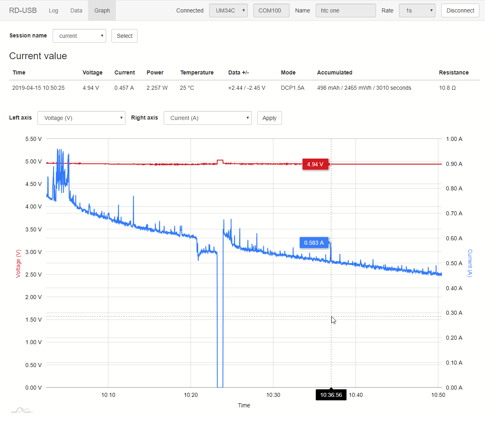
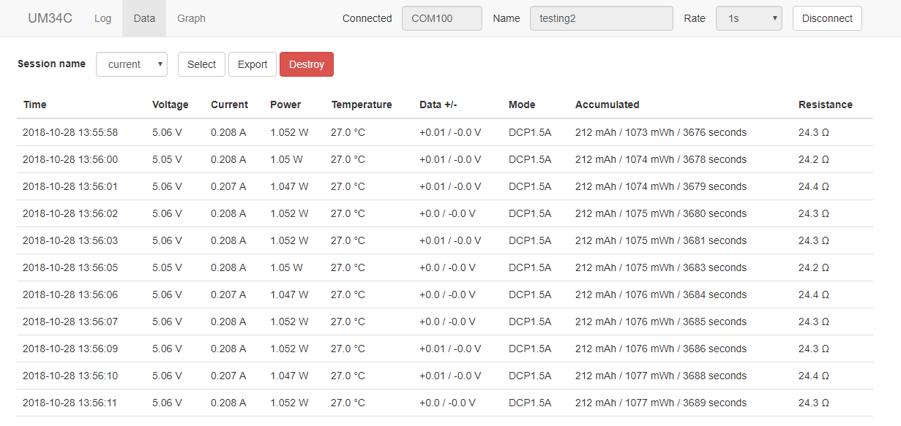

Web GUI for RuiDeng USB testers (UM34C, UM24C, UM25C, TC66C)
==

Simple web GUI written in Python 3. Measurements are stored in sqlite database. Tables and graphs are supported.
Live preview and graphing is also available.

Tested on UM34C/UM24C/UM25C/TC66C.

Based on https://github.com/sebastianha/um34c


Requirements
--

- UM34C/UM24C/UM25C - meter connected via regular Bluetooth
- TC66C - meter is using BLE instead of regular bluetooth so pairing will not work nor RFCOMM will
    - BLE has limited support on desktop devices, see used library for supported platforms and versions:
      https://github.com/hbldh/bleak#features
- TC66C USB - meter connected with USB
    - Meter connected with USB exposes itself as serial port
- UM34C/UM24C/UM25C (legacy serial/COM port method) - meter can be connected as serial port
    - Pairing with Windows Settings works fine. Pin is 1234. After successful pairing some serial ports are
      installed. In my case two. One of them works.
    - On Linux `rfcomm` and `hcitool` can be used (both provided by bluez package)
        - Retrieve bluetooth address with `hcitool scan`
        - Bind retrieved address to serial port with `rfcomm bind 0 aa:bb:cc:dd:ee:ff`.
          This step is not persistent. Serial port will disappear after reboot. Also rd-usb needs to
          have permissions to use /dev/rfcommX.

Installation
--

### Binaries (Win x64 only)

- Download from [releases](https://github.com/kolinger/rd-usb/releases)
    - **rd-usb-x.exe** is CLI web server application. GUI is provided by web browser.
      Run executable and web server will be shortly spawned on address http://127.0.0.1:5000.
    - **rd-usb-install-x.exe** is installer of standalone GUI application. Works without web browser.
      Embedded browser is used instead. External web browser still can be used with address (see above).
- Application will be probably blocked by Microsoft SmartScreen. For unblock click `More info`
  and `Run anyway`. I don't have certificate for signing and application does not have any
  reputation so Microsoft will block by default.

### Source code

1. Python 3.7 or newer is required
2. Download `rd-usb-source-x.zip` from [releases](https://github.com/kolinger/rd-usb/releases)
   or `git clone https://github.com/kolinger/rd-usb.git`
3. Install requirements
    - For GUI: `pip install -r requirements.txt`
    - For headless `pip install -r requirements_headless.txt` this version doesn't
      contain dependencies for embedded browser GUI. This is useful if you plan to use CLI/webserver only.
      Also useful on ARM SBCs.
4. Run with `python web.py` - this will spawn web server on http://127.0.0.1:5000, port can be changed
   with first argument: `python web.py 5555`

For additional arguments/options use --help: `python web.py --help`.

On Windows `python` can be found in Python's installation folder.
For example replace `python` with `C:\Python37\python.exe web.py`
and `pip` with `C:\Python37\python.exe -m pip install -r requirements.txt`.

On Linux use `python3` and `pip3`.

Usage
--

**UM34C/UM24C/UM25C Bluetooth**

1. Select your device version.
2. Name your session. For example 'testing some power bank'. This is
   used to separate multiple measurements from each other.
3. Select sample rate. Faster sample rate will result in more accurate data but also
   will create a lot more data. For short measurements use faster sample rate. For longer
   use slower rate. Choose carefully.
4. Select UM34C/UM24C/UM25C from devices and follow with Setup link.
    1. If previously connected you can initiate Setup again by clicking on current Bluetooth address
5. Scan for devices and select your device from list by clicking on it
6. After this you can connect simply by using Connect button. Setup is required only for new/different device.
7. Connection will be hopefully successful, and you will see live measurements in graph.
   Otherwise, read log for error messages.

**TC66C Bluetooth**

1. Make sure your OS is supported and has bluetooth with BLE support (Bluetooth Low Energy)
2. Rest is same as other devices. See above.

**TC66C USB or legacy UM34C/UM24C/UM25C RFCOMM serial/COM port method**

1. Select UM34C/UM24C/UM25C with Serial suffix.
2. Follow Setup link to find your serial port or click Connect if you already have port selected.
3. Rest is same as other devices. See above.


Graphs
--




Tables
--



Custom data directory
--
Custom data directory can be specified with `--data-dir` option.

For example `rd-usb.exe --data-dir C:/rd-usb` will place all configuration and data files in `C:/rd-usb` directory.
This can be used together with shortcut, just make sure you escape path with quotes properly, for example:
`"C:\your\path\rd-usb.exe" --data-dir "C:\your\path\data"`.

Custom export
--

Application has basic CSV export built-in. For more advanced use-cases external script can be used.

External program/script can be specified with `--on-receive` option.
This script will be executed when new data is received.
New measurements are provided as JSON file. Path of this file is provided as first argument.

For managing overhead another option `--on-receive-interval` is available (default value is 60).
This number specified how often is external script called (in seconds, default value is every minute).
Value 0 means script will be called for every new measurement as they happen.
Script is not called when no new measurements are available.

CLI example: `python web.py --on-receive on-receive.sh`

See `on-receive.sh` or `on-receive.cmd` files for more information how implement this program/script.

Example structure of JSON file:

```
[
    {
        "timestamp": 1599556295,
        "voltage": 5.12,
        "current": 0.0,
        "power": 0.0,
        "temperature": 25,
        "data_plus": 0.0,
        "data_minus": 0.0,
        "mode_id": 7,
        "mode_name": "DCP1.5A",
        "accumulated_current": 0,
        "accumulated_power": 0,
        "accumulated_time": 0,
        "resistance": 9999.9,
        "name": "measurement name"
    },
    ...
]
```

Reverse proxy
--

If you like to have HTTPS (or use reverse proxy for other reasons) then simple reverse proxy can be used.
All common webservers can do this. Here are examples for nginx.

You can also modify on what address/interface is rd-usb listening by providing `--listen` CLI option
like `--listen 192.168.1.100` where `192.168.1.100` is address of interface you want to listen on.

At root:

````
server {
	listen 443 ssl;
	listen [::]:443 ssl;

	ssl_certificate /your/certificate.crt;
	ssl_certificate_key /your/certificate.key;

	server_name rd-usb;

	location / {
		proxy_pass http://127.0.0.1:5000;
	}
}
````

In path:

````
server {
	listen 443 ssl;
	listen [::]:443 ssl;

	ssl_certificate /your/certificate.crt;
	ssl_certificate_key /your/certificate.key;

	server_name domain.tld;

	# your other things

	location /rd-usb {
		proxy_pass http://127.0.0.1:5000;
	}
}
````

When some prefix/path is used then it needs to be specified as argument `--prefix` when launching rd-usb.
In this example `--prefix /rd-usb` is required resulting in something like `python3 web.py --prefix /rd-usb`.

Note: `rd-usb` should not be exposed on untrusted network or to untrusted users.
Use [HTTP basic auth](https://docs.nginx.com/nginx/admin-guide/security-controls/configuring-http-basic-authentication/)
for example as authentication mechanism when running rd-usb at untrusted network.

Systemd service
--

If you would like to have rd-usb start automatically on unix systems, you can grab the example service files,
drop them in `/etc/systemd/system/` respectively:

/etc/systemd/system/rfcomm0.service

```
[Unit]
Description=rfcomm0
After=bluetooth.target

[Service]
Type=oneshot
User=root
ExecStart=/usr/bin/rfcomm bind 0 <METER_BT_MAC_ADDRESS>
ExecStart=/usr/bin/chown root:dialout /dev/rfcomm0
ExecStop=/usr/bin/rfcomm release 0
RemainAfterExit=yes
Restart=no

[Install]
WantedBy=multi-user.target
```

```
systemctl enable rfcomm0.service
systemctl start rfcomm0.service
```

/etc/systemd/system/rd-usb.service

```
[Unit]
Description=rd-usb
After=network.target
After=rfcomm0.service

[Service]
Type=simple
WorkingDirectory=</path/to/rd-usb>
ExecStart=/usr/bin/python3 web.py --daemon
User=www-data
Group=www-data
Restart=always
RestartSec=30

[Install]
WantedBy=multi-user.target
```

```
systemctl enable rd-usb.service
systemctl start rd-usb.service
```

Don't forget to add user of rd-usb.service to `dialout` group to enable access to /dev/rfcomm0 for communication.
In this example you need to add `www-data` to `dialout` like this `usermod -aG dialout www-data`.
Webserver as reverse proxy in front of rd-usb.service is suggested (like nginx, apache2, ...).

Development
--

### Building binaries

1. Install pyinstaller: `pip install pyinstaller` (4.x) and [NSIS](https://nsis.sourceforge.io/Download) installer
2. Generate binaries:
    - `pyinstaller pyinstaller-cli.spec`
    - `pyinstaller pyinstaller.spec`
    - `makensis.exe installer.nsi`
    - or use `build.cmd`
3. Binaries will be saved in `dist` directory
